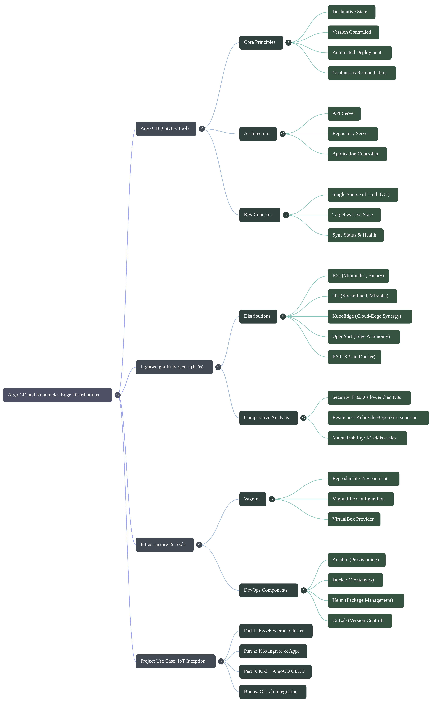

# Inception-of-Things (IoT)

> A hands-on introduction to **Kubernetes**, **Infrastructure as Code**, and **GitOps** — built with **K3s**, **Vagrant**, **K3d**, and **Argo CD**.

<p align="left">
  
  
  
  
  
  
</p>

<p align="center">
  
</p>

---

## 📑 Table of Contents

- [Overview](#-overview)
- [Architecture at a Glance](#-architecture-at-a-glance)
- [Repository Structure](#-repository-structure)
- [Prerequisites](#️-prerequisites)
- [Part 1 — K3s and Vagrant](#-part-1--k3s-and-vagrant)
- [Part 2 — K3s and Three Simple Applications](#-part-2--k3s-and-three-simple-applications)
- [Part 3 — K3d and Argo CD](#-part-3--k3d-and-argo-cd)
- [Bonus — GitLab Integration](#-bonus--gitlab-integration)
- [Key Concepts](#-key-concepts)
- [Verifying the Setup](#-verifying-the-setup)
- [Troubleshooting](#-troubleshooting)
- [Demo & Documentation](#-demo--documentation)
- [Team](#-team)

---

## 📖 Overview

**Inception-of-Things** is a systems administration and cloud-native infrastructure project that walks through building lightweight Kubernetes environments from the ground up. It progressively introduces:

- Manual cluster orchestration using **Vagrant** virtual machines and the **K3s** binary distribution
- **Ingress**-based traffic routing across multiple applications
- Containerized clusters using **K3d** (K3s running inside Docker)
- **GitOps** continuous delivery with **Argo CD**, driven entirely by Git commits

The project is designed for developers transitioning from basic system administration toward modern, automated, cloud-native workflows — starting with manual VM provisioning and ending with a fully automated GitOps pipeline.

---

## 🧱 Architecture at a Glance

```
┌───────────────────────────────┐  ┌───────────────────────────────┐  ┌───────────────────────────────┐
│            Part 1             │  │            Part 2             │  │            Part 3             │
│      K3s + Vagrant (VMs)      │  │     K3s + Ingress (1 VM)      │  │     K3d + Argo CD (Docker)    │
│                               │  │                               │  │                               │
│  [login]S   → Server/Master   │  │  app1.com → App 1             │  │  Namespace: argocd            │
│  192.168.56.110               │  │  app2.com → App 2 (x3 pods)   │  │  Namespace: dev               │
│                               │  │  *        → App 3 (default)   │  │  GitOps sync from GitHub      │
│  [login]SW  → Agent/Worker    │  │  192.168.56.110               │  │  App versions: v1 → v2        │
│  192.168.56.111               │  │                               │  │                               │
└───────────────────────────────┘  └───────────────────────────────┘  └───────────────────────────────┘
```

---

## 📂 Repository Structure

```text
Inception-of-Things/
├── p1/                     # K3s + Vagrant: two-node cluster (server + agent)
│   └── Vagrantfile
│
├── p2/                     # K3s + Ingress: three applications on one VM
│   ├── Vagrantfile
│   ├── scripts/
│   └── confs/
│
├── p3/                     # K3d + Argo CD: GitOps continuous delivery
│   ├── scripts/
│   └── confs/
│
├── bonus/                  # GitLab integration (optional)
│   ├── Vagrantfile
│   ├── scripts/
│   └── confs/
│
├── docs/                   # Diagrams, video walkthrough, write-up
│   ├── Map.png
│   ├── K3s_&_K3d_Explained.mp4
│   └── Inception-explain.pdf
│
└── README.md
```

---

## ⚙️ Prerequisites

| Tool | Purpose |
|---|---|
| [VirtualBox](https://www.virtualbox.org/) | Virtual machine hypervisor for Parts 1 & 2 |
| [Vagrant](https://www.vagrantup.com/) | VM provisioning and automation |
| [Docker](https://www.docker.com/) | Container runtime for Part 3 (K3d) |
| [K3d](https://k3d.io/) | Lightweight K3s-in-Docker wrapper |
| [kubectl](https://kubernetes.io/docs/tasks/tools/) | Kubernetes CLI |
| [Argo CD CLI](https://argo-cd.readthedocs.io/) | GitOps continuous delivery tool |

Base OS used across all VMs: **Alpine Linux**, chosen for its minimal footprint and resource efficiency.

> 💡 **Tip:** Confirm each tool is installed and on your `PATH` before starting:
> ```bash
> vagrant --version && VBoxManage --version && docker --version && k3d version && kubectl version --client
> ```

---

## 🧩 Part 1 — K3s and Vagrant

**Goal:** Provision a two-node Kubernetes cluster manually using Vagrant, with each node running a distinct K3s role.

| Machine | Role | IP Address |
|---|---|---|
| `[login]S`  | Server (K3s controller / master) | `192.168.56.110` |
| `[login]SW` | ServerWorker (K3s agent / worker) | `192.168.56.111` |

- Both machines communicate over a **private network**.
- The server initializes the K3s control plane; the agent joins it using the server's node token.
- Machine naming must follow the `[login]S` / `[login]SW` convention.

```bash
cd p1/
vagrant up

vagrant ssh <login>S    # verify the control plane
kubectl get nodes       # confirm both nodes are Ready
```

**Expected output:**
```
NAME       STATUS   ROLES                  AGE   VERSION
<login>s   Ready    control-plane,master   1m    v1.x.x+k3s1
<login>sw  Ready    <none>                 30s   v1.x.x+k3s1
```

---

## 🧩 Part 2 — K3s and Three Simple Applications

**Goal:** Deploy three web applications on a single K3s server and route traffic between them using **Ingress**, based on hostname.

| Hostname | Target | Notes |
|---|---|---|
| `app1.com` | App 1 | Single replica |
| `app2.com` | App 2 | **3 replicas** |
| *(any other host)* | App 3 | Default backend |

All applications are accessible via the shared IP `192.168.56.110`, with the Ingress controller routing requests based on the `Host` header.

```bash
cd p2/
vagrant up

curl -H "Host: app1.com" http://192.168.56.110
curl -H "Host: app2.com" http://192.168.56.110
curl http://192.168.56.110   # falls back to app3
```

---

## 🧩 Part 3 — K3d and Argo CD

**Goal:** Move from VM-based infrastructure to a **containerized** K3d cluster and implement a full **GitOps** delivery pipeline with Argo CD.

- Cluster runs entirely inside Docker via K3d — no VMs required.
- Two namespaces are created:
  - `argocd` — hosts the Argo CD control plane
  - `dev` — hosts the deployed application
- Argo CD continuously watches a **GitHub repository** and automatically syncs the cluster state to match it.
- The deployed application supports two versions, **v1** and **v2**; updating the manifest in Git (e.g., changing the image tag) triggers an automatic rollout.

```bash
cd p3/
./scripts/setup-k3d-cluster.sh

kubectl create namespace argocd
kubectl create namespace dev
kubectl apply -n argocd -f confs/argocd-install.yaml

# Access the Argo CD UI
kubectl port-forward svc/argocd-server -n argocd 8080:443
```

Retrieve the initial admin password and log in at `https://localhost:8080`:

```bash
kubectl -n argocd get secret argocd-initial-admin-secret \
  -o jsonpath="{.data.password}" | base64 -d
```

Trigger a version update by committing a change to the Git repository Argo CD is tracking (e.g., `v1 → v2`), then watch Argo CD auto-sync the new state into the `dev` namespace.

---

## 🎁 Bonus — GitLab Integration

Extends Part 3 by replacing GitHub with a **self-hosted GitLab instance** as the source of truth for the GitOps workflow:

- A local GitLab instance runs inside the same cluster/Docker environment.
- Argo CD is reconfigured to track the local GitLab repository instead of GitHub.
- The same `v1 → v2` update workflow applies, now fully self-contained.

```bash
cd bonus/
./scripts/setup-gitlab.sh
```

---

## 🔑 Key Concepts

| Concept | Description |
|---|---|
| **K3s** | A certified, lightweight Kubernetes distribution packaged as a single binary, ideal for edge, IoT, and resource-constrained environments. |
| **K3d** | A wrapper that runs K3s clusters inside Docker containers, removing the need for VMs and speeding up local development. |
| **Ingress** | Manages external HTTP access to services within a cluster, enabling hostname- and path-based routing. |
| **GitOps** | An operational model where Git is the single source of truth, and tools like Argo CD continuously reconcile the live cluster state with the declared state in a repository. |
| **Vagrant** | Declarative tool for building and managing reproducible VM environments from a single `Vagrantfile`. |

---

## 🧪 Verifying the Setup

```bash
# Part 1 & 2
kubectl get nodes -o wide
kubectl get pods -A

# Part 3
kubectl get applications -n argocd
kubectl get pods -n dev
```

---

## 🛠 Troubleshooting

| Issue | Likely Cause | Fix |
|---|---|---|
| `vagrant up` hangs on "Waiting for VM to boot" | VirtualBox network adapter conflict | Restart VirtualBox host-only networking, or re-run `vagrant up` |
| Nodes stuck in `NotReady` | Agent couldn't reach the server's token/API | Check private network IPs and firewall rules between VMs |
| `curl` returns connection refused | Ingress controller not yet ready | Wait a few seconds and re-check with `kubectl get pods -A` |
| Argo CD UI unreachable | Port-forward not running or wrong namespace | Re-run the `kubectl port-forward` command in `p3` |
| App not syncing after Git push | Argo CD auto-sync disabled or polling interval | Manually sync via `argocd app sync <app-name>` or check the Application manifest |

---

## 🎥 Demo & Documentation

- 📹 **Video walkthrough:** [K3s & K3d Explained](./docs/K3s_&_K3d_Explained.mp4)
- 🖼️ **Architecture mind map:** [Map.png](./docs/Map.png)
- 📄 **Full write-up (PDF):** [Inception-explain.pdf](./docs/Inception-explain.pdf)

---

## 👤 Team

| Member | Role |
|---|---|
| **mel-garr** | School 42 / 1337 student — *Inception-of-Things* |
| **aelidrys** | School 42 / 1337 student — *Inception-of-Things* |

---

<p align="center"><i>Built as part of the 42/1337 Common Core curriculum.</i></p>
