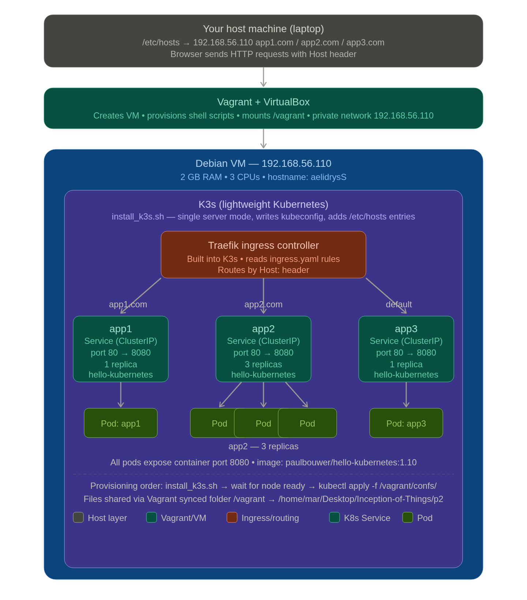

# Part 2 — K3s and Three Simple Applications

> **Inception-of-Things | 1337 School**  
> One VM · One K3s cluster · Three apps · Ingress routing by hostname


---

## Table of contents

1. [What this part does](#what-this-part-does)
2. [Core concepts you need to understand](#core-concepts-you-need-to-understand)
   - [Vagrant and VirtualBox](#vagrant-and-virtualbox)
   - [K3s — lightweight Kubernetes](#k3s--lightweight-kubernetes)
   - [Deployments and Pods](#deployments-and-pods)
   - [Services](#services)
   - [Ingress and Traefik](#ingress-and-traefik)
   - [Host header routing](#host-header-routing)
3. [How the files connect](#how-the-files-connect)
4. [The full request journey](#the-full-request-journey)
5. [File-by-file breakdown](#file-by-file-breakdown)
6. [Common mistakes and fixes](#common-mistakes-and-fixes)
7. [Verification commands](#verification-commands)

---

## What this part does

Part 2 proves you can run a real Kubernetes workload on a single VM and route
HTTP traffic to different applications based on domain name — without touching
port numbers.

The end result: a browser on your laptop can visit `app1.com`, `app2.com`, or
any other host, and land on a different application each time, all served from
`192.168.56.110`.

---

## Core concepts you need to understand

### Vagrant and VirtualBox

**VirtualBox** is a hypervisor — it creates and runs virtual machines on your
laptop as if they were separate physical computers.

**Vagrant** is a tool that automates VirtualBox. Instead of clicking through a
GUI to create a VM, you describe the machine in a `Vagrantfile` and run
`vagrant up`. Vagrant handles box download, network setup, shared folders, and
running provisioning scripts inside the VM.

Key Vagrant vocabulary:

| Term | Meaning |
|---|---|
| Box | A pre-built OS image (here: `debian/bookworm64`) |
| Machine name | The Vagrant identifier — always `default` unless you use `config.vm.define` |
| Hostname | The OS hostname set inside the VM (`aelidrysS`) |
| VirtualBox name | The label shown in the VirtualBox GUI (`vb.name`) |
| Private network | A host-only network where your laptop and VM can talk directly |
| Synced folder | A directory shared between host and VM (`/vagrant` inside VM) |
| Provisioner | A script Vagrant runs automatically after boot |

> **Important**: `vagrant ssh` uses the **machine name** (`default`), not the
> hostname or VirtualBox name. `vagrant ssh aelidrysS` fails because `aelidrysS`
> is only the hostname. Just use `vagrant ssh`.

---

### K3s — lightweight Kubernetes

Kubernetes is a system for running, scaling, and managing containers. Full
Kubernetes is complex and resource-heavy. **K3s** is a certified, production-
ready distribution that fits in a single ~100 MB binary — perfect for VMs and
edge devices.

K3s gives you the full Kubernetes API but with sensible defaults bundled in:
- SQLite instead of etcd for state storage
- Traefik as the built-in ingress controller
- Flannel for container networking

When `install_k3s.sh` runs `curl -sfL https://get.k3s.io | sh -`, it:
1. Downloads the `k3s` binary to `/usr/local/bin/`
2. Creates a systemd service so K3s starts on boot
3. Writes a kubeconfig to `/etc/rancher/k3s/k3s.yaml` (chmod 644 so `vagrant`
   user can read it without sudo)
4. Starts the K3s server — which also starts the embedded Traefik ingress

---

### Deployments and Pods

A **Pod** is the smallest unit in Kubernetes. It wraps one or more containers
and gives them a shared network namespace.

A **Deployment** manages Pods. You tell it "I want 3 replicas of this
container", and it makes sure 3 are always running. If one dies, it starts
a new one automatically.

```
Deployment (app2)
├── Pod (app2-xxx-aaa)  ← container: hello-kubernetes, port 8080
├── Pod (app2-xxx-bbb)  ← container: hello-kubernetes, port 8080
└── Pod (app2-xxx-ccc)  ← container: hello-kubernetes, port 8080
```

The `replicas` field in the YAML is what controls this:

```yaml
spec:
  replicas: 3   # app2 has 3; app1 and app3 have 1
```

---

### Services

Pods are ephemeral — they get new IP addresses every time they restart.
A **Service** gives you a stable internal address that always points to the
healthy pods for a given app.

```
Service (app2)  →  load-balances across  →  Pod, Pod, Pod
  ClusterIP: 10.x.x.x
  port: 80  →  targetPort: 8080
```

The Service uses a **selector** to find its pods:

```yaml
# Service
spec:
  selector:
    app: app2        # finds all pods with this label

# Deployment template
  template:
    metadata:
      labels:
        app: app2    # this label matches the selector above
```

Services of type `ClusterIP` (the default) are only reachable from inside the
cluster. That is fine — the Ingress (below) is what exposes them to the outside.

---

### Ingress and Traefik

An **Ingress** is a Kubernetes object that defines HTTP routing rules. By itself
it is just configuration — it does nothing without an **Ingress Controller** to
read those rules and actually route traffic.

K3s bundles **Traefik** as its ingress controller. Traefik watches for Ingress
objects and automatically configures itself to route incoming HTTP requests
according to their rules.

```
Traefik (running in K3s)
  reads ingress.yaml rules
  listens on :80 of the VM's network interfaces
  routes by Host header → Service → Pod
```

---

### Host header routing

When your browser visits `http://app1.com`, it sends an HTTP request that looks
like this:

```
GET / HTTP/1.1
Host: app1.com
...
```

The `Host:` header is what tells Traefik which backend to use. This is how one
IP address (`192.168.56.110`) can serve multiple different applications — the
IP gets the request to Traefik, then the `Host:` header routes it to the right
Service.

For this to work your **host machine's `/etc/hosts`** must map the domain names
to the VM's IP:

```
192.168.56.110  app1.com
192.168.56.110  app2.com
192.168.56.110  app3.com
```

Without this, `app1.com` goes to a public DNS server which has no idea what
`app1.com` is.

> `install_k3s.sh` adds these entries to the **VM's** `/etc/hosts` for internal
> testing with `curl`. Your **laptop's** `/etc/hosts` needs them too for browser
> access.

---

## How the files connect

```
Vagrantfile
  ├── sets VM IP: 192.168.56.110
  ├── runs scripts/install_k3s.sh  (NODE_IP=192.168.56.110)
  └── runs inline provisioner:
        kubectl apply -f /vagrant/confs/
                            ├── app1.yaml   → Deployment + Service
                            ├── app2.yaml   → Deployment (3 replicas) + Service
                            ├── app3.yaml   → Deployment + Service
                            └── ingress.yaml → Ingress rules for Traefik

install_k3s.sh
  ├── installs K3s binary
  ├── starts K3s systemd service
  ├── adds /etc/hosts entries (VM-internal only)
  └── adds 'alias k=kubectl' to .bashrc
```

The synced folder (`/home/mar/Desktop/Inception-of-Things/p2` on the host →
`/vagrant` inside the VM) means all your YAML files are available inside the VM
at `/vagrant/confs/` without any copying.

---

## The full request journey

```
1. Browser on your laptop
   → looks up "app2.com" in /etc/hosts
   → finds 192.168.56.110

2. Browser sends HTTP request
   GET / HTTP/1.1
   Host: app2.com
   → to 192.168.56.110:80

3. Traefik (inside K3s VM) receives request
   → reads ingress.yaml rules
   → Host: app2.com matches the app2 rule
   → forwards to Service "app2" on port 80

4. Service "app2" (ClusterIP)
   → load-balances across 3 running Pods
   → translates port 80 → 8080

5. Pod receives request on port 8080
   → hello-kubernetes container responds
   → "Hello from app2"

6. Response travels back through Service → Traefik → browser
```

For any hostname other than `app1.com` or `app2.com` (e.g. `curl 192.168.56.110`
or `curl -H "Host: whatever.com" ...`), the ingress catch-all rule at the
bottom of `ingress.yaml` (no `host:` field) routes to app3.

---

## File-by-file breakdown

### Vagrantfile

```ruby
SERVER_IP = "192.168.56.110"   # VM's IP on the private network
SERVER_HOSTNAME = "aelidrysS"  # OS hostname — NOT the Vagrant machine name

config.vm.box = "debian/bookworm64"
config.vm.hostname = SERVER_HOSTNAME      # sets /etc/hostname inside VM
config.vm.network "private_network", ip: SERVER_IP  # host-only adapter

vb.memory = 2048   # K3s needs at least 512MB; 2GB is comfortable
vb.cpus = 3
vb.name = SERVER_HOSTNAME    # VirtualBox GUI label — not used by vagrant ssh
```

The two provisioners run in order: first `install_k3s.sh`, then the inline
script that waits for K3s to be ready and applies the manifests.

---

### install_k3s.sh

```bash
INSTALL_K3S_EXEC="server \
  --node-ip=${NODE_IP} \       # tells K3s which IP to advertise
  --write-kubeconfig-mode=644" # makes kubeconfig readable without sudo
```

The `--node-ip` flag ensures K3s binds to the private network IP, not just
localhost. Without it, Traefik may not listen on `192.168.56.110`.

---

### app1.yaml / app3.yaml (1 replica)

```yaml
spec:
  replicas: 1        # one Pod
  containers:
    - image: paulbouwer/hello-kubernetes:1.10
      env:
        - name: MESSAGE
          value: "Hello from app1"   # shown on the webpage
      ports:
        - containerPort: 8080        # what the app listens on inside the container
```

The Service maps `port: 80` (cluster-internal) → `targetPort: 8080` (container).

---

### app2.yaml (3 replicas)

Identical structure but `replicas: 3`. Kubernetes schedules three independent
pods. The Service load-balances requests across all three round-robin. You can
see this if you watch the pod hostname change as you refresh the page.

---

### ingress.yaml

```yaml
rules:
  - host: "app1.com"   → backend: service app1, port 80
  - host: "app2.com"   → backend: service app2, port 80
  # no host field:     → backend: service app3, port 80  (catch-all)
```

The `app3.com` rule is intentionally commented out. The spec says "any other
host goes to app3", so the catch-all rule (no `host:` field) handles it. Typing
`app3.com` in your browser also hits app3, because the catch-all matches
anything not explicitly listed above it.

`ingressClassName: "traefik"` tells Kubernetes which ingress controller should
handle these rules (important if multiple controllers exist).

---

## Common mistakes and fixes

| Mistake | Symptom | Fix |
|---|---|---|
| `vagrant ssh aelidrysS` | "machine not found" | Use `vagrant ssh` — machine name is `default` |
| Browser can't reach `app1.com` | DNS error or wrong site | Add entries to your **host** `/etc/hosts`, not just the VM's |
| `kubectl apply` fails | "connection refused" | Provisioner ran before K3s was ready — the `until kubectl get nodes` loop should handle this; if not, `vagrant provision` again |
| Pods stuck in `Pending` | `kubectl get pods` shows Pending | VM may be out of memory; check `free -h` inside the VM |
| app3 not reachable | No response | Check that the catch-all rule (no host) is present at bottom of ingress.yaml |

---

## Verification commands

Run these inside the VM after `vagrant ssh`:

```bash
# Check K3s is running
sudo systemctl status k3s

# Check node is ready
kubectl get nodes

# Check all pods are Running (not Pending or CrashLoopBackOff)
kubectl get pods

# Check services exist
kubectl get services

# Check ingress was created
kubectl get ingress

# Test routing from inside the VM
curl -H "Host: app1.com"   http://192.168.56.110
curl -H "Host: app2.com"   http://192.168.56.110
curl -H "Host: anything"   http://192.168.56.110   # should hit app3

# Watch pod names change across 3 app2 replicas (proves load balancing)
for i in $(seq 1 6); do
  curl -s -H "Host: app2.com" http://192.168.56.110 | grep "pod name"
done
```

From your **host machine** (after adding `/etc/hosts` entries):

```bash
curl http://app1.com
curl http://app2.com
curl http://app3.com        # hits catch-all → app3
curl http://anything.com    # also hits app3
```